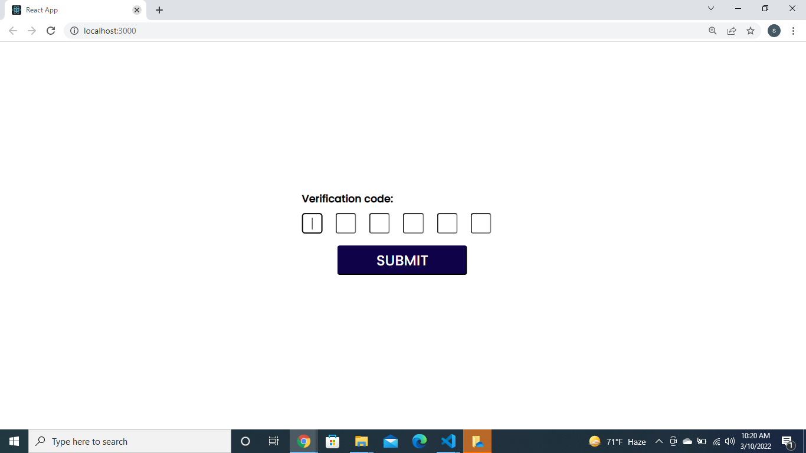
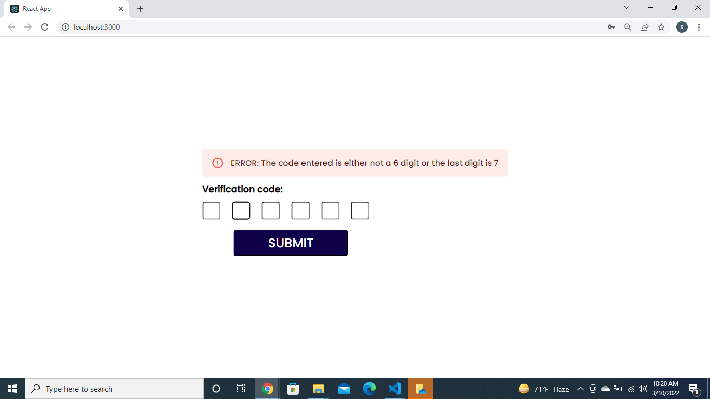

# verification-code

- Pre-requirements
  - `Node.js`
    Installed in the computer.
- cd into cloned directory.

- You can find two directories:

  - **ui** : contains frontend of the application

  - **server** : contains the backend code

- cd into each of the above mentioned directories i.e:ui and server in seperate terminal and,

  - Install require dependencies:
    `npm install`
  - Start the server:
    `npm start`

- Open `http://localhost:3000` in browser, and you can see the messages.
  
  
